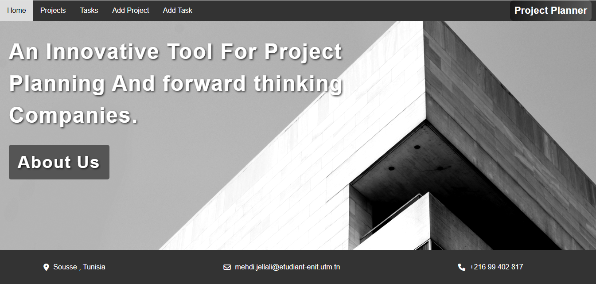
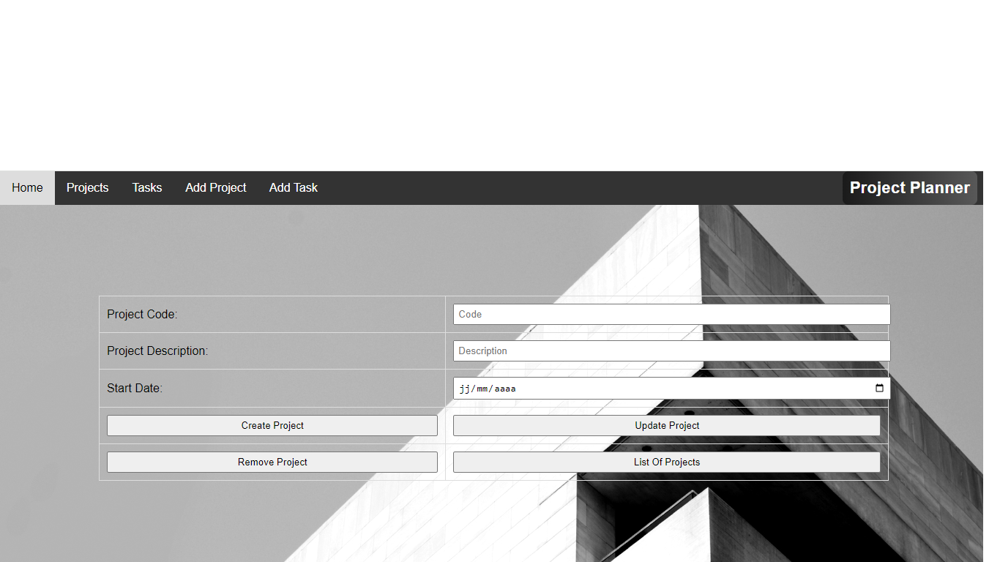
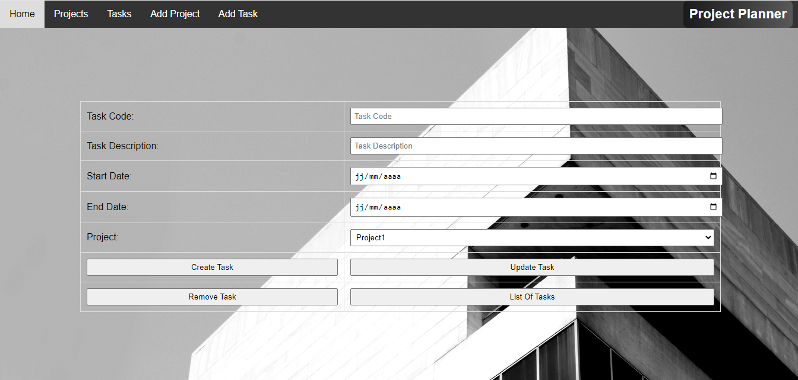
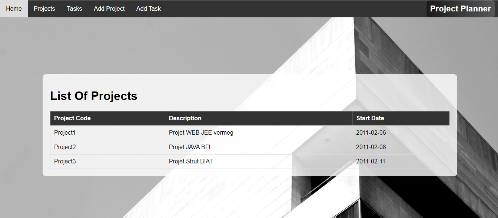
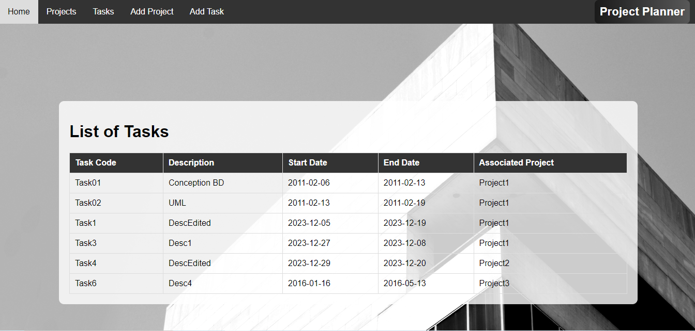

# Project Planner

## Overview

The **Project Planner** is a Java Enterprise Edition (JEE) application designed to assist project managers in planning and managing projects.This project was developed to explore and apply Java EE concepts, such as JPA, JDBC, Hibernate, and Servlets, and to better understand object-oriented programming principles like polymorphism, encapsulation, inheritance, and abstraction.
## Project Architecture

The application is divided into two sub-projects:

1. **EJB Sub-Project**
   - **Entities:** 
     - `Project`
     - `Task`
     - These entities are represented in the class diagram below:
   - **Interfaces:**
     - `ProjectDao` (Local)
     - `TaskDao` (Local)
   - **Session Beans:**
     - Stateless session beans:
       - `ProjectDaoImpl`
       - `TaskDaoImpl`

2. **Web Sub-Project**

   This sub-project handles the web interface and interacts with the EJB sub-project to manage the business logic of the application.

## Features

- **Project and Task Management:** Create and manage projects and tasks, assign team members, and handle project constraints.
- **JPA Integration:** Use Java Persistence API (JPA) for managing relational data.
- **DAO Pattern:** Implement Data Access Object (DAO) pattern for data handling.
- **JDBC and Hibernate:** Understand and apply JDBC and Hibernate for database interaction.

## Technologies Used

- **Java EE**
- **EJB (Enterprise JavaBeans)**
- **JPA (Java Persistence API)**
- **JDBC (Java Database Connectivity)**
- **Hibernate**
- **Servlets**
- **Eclipse IDE**
- **MySQL**

  ## Screenshots

### Home Page

### Add Project

### Add Task

### List of Projects

### List of Tasks

